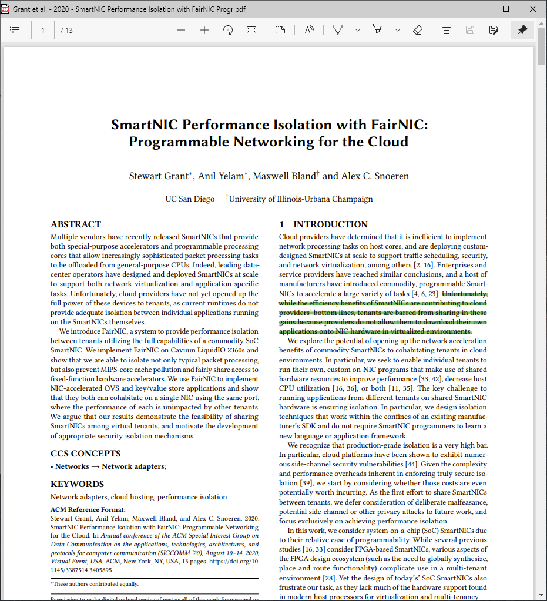

# simple-pdf-reader
Open/edit PDF in Microsoft Edge's App mode

## Quickstart

1. Prerequist: Microsoft Edge and Python3 installed
2. Ensure the variables `PYTHON_BIN` and `EDGE_BIN` are set correctly
3. Change the default PDF reader to the script `SimplePdfReader.bat`
4. Now, you can open any PDF in Microsoft Edge's App mode

## Screenshot

